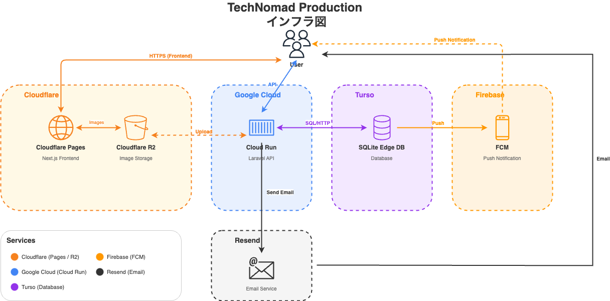

# TechNomadSpace

ノマドワーカー・リモートワーカー向けのコワーキングスペース検索サービス

## 概要

TechNomadSpaceは、**契約不要・予約不要**で今すぐ使えるコワーキングスペースだけを掲載した検索プラットフォームです。

ドロップイン（時間課金）、ワンドリンク制、完全無料の施設のみを厳選。地図から簡単に検索でき、ユーザーレビューで施設の雰囲気を事前に確認できます。

## 特徴

- **すぐ使える施設だけ** - 月額契約が必要な施設は掲載対象外
- **地図ベース検索** - 現在地周辺の施設をマップで一覧表示
- **料金が明確** - 無料/ワンドリンク制/時間課金の3タイプで分類
- **設備情報** - WiFi・電源・モニター・個室ブースの有無を確認可能
- **ユーザーレビュー** - 実際の利用者の評価・写真を閲覧

## 技術スタック

### フロントエンド
- Next.js 16
- React 19
- TypeScript
- Tailwind CSS
- Chakra UI
- Leaflet（地図表示）

### バックエンド
- Laravel 12
- PHP 8.2+
- Laravel Sanctum（認証）
- Laravel Socialite（Google OAuth）

### インフラ（開発環境）
- Docker / Docker Compose
- MySQL 8.0
- Nginx

### インフラ（本番環境）
- **Cloudflare Pages** - フロントエンド（Next.js）のホスティング
- **Cloudflare R2** - 画像ストレージ（S3互換）
- **Google Cloud Run** - バックエンド（Laravel API）のホスティング
- **Turso** - SQLite互換のエッジデータベース
- **Firebase Cloud Messaging** - プッシュ通知
- **Resend** - メール送信サービス

#### インフラ構成図



## セットアップ

### 必要環境
- Docker Desktop
- Git

### インストール手順

```bash
# 1. リポジトリをクローン
git clone https://github.com/your-username/TechNomadSpace.git
cd TechNomadSpace

# 2. 環境変数ファイルを作成
cp backend/src/app/.env.example backend/src/app/.env
cp frontend/next/.env.example frontend/next/.env.local

# 3. Dockerコンテナをビルド・起動
docker compose build
docker compose up -d

# 4. バックエンドのセットアップ
docker compose exec api bash
composer install
php artisan key:generate
php artisan migrate
php artisan db:seed
exit

# 5. フロントエンドのセットアップ
docker compose exec next sh
npm install
exit
```

### 開発サーバー

| サービス | URL | 説明 |
|---------|-----|------|
| フロントエンド | http://localhost:3000 | Next.js |
| バックエンドAPI | http://localhost:8000 | Laravel |
| phpMyAdmin | http://localhost:10000 | DB管理 |

## 主な機能

### ユーザー向け機能
- メール/パスワードでのユーザー登録・ログイン
- Googleアカウントでのソーシャルログイン
- コワーキングスペースの検索・詳細閲覧
- レビューの投稿・編集・削除
- お気に入り施設の登録
- プッシュ通知の受信

### 施設情報
- 基本情報（名前、住所、電話番号、Webサイト）
- 料金情報（時間料金、日料金、最低料金）
- 設備情報（WiFi、電源、モニター、個室ブース、フリードリンク）
- 営業時間（曜日別）
- ユーザーレビュー・写真

## ディレクトリ構成

```
TechNomadSpace/
├── frontend/
│   └── next/              # Next.jsアプリケーション
│       ├── app/           # ページ（App Router）
│       ├── components/    # Reactコンポーネント
│       ├── services/      # API通信
│       └── types/         # 型定義
├── backend/
│   └── src/
│       └── app/           # Laravelアプリケーション
│           ├── app/
│           │   ├── Http/Controllers/
│           │   ├── Models/
│           │   └── Services/
│           ├── database/
│           │   ├── migrations/
│           │   └── seeders/
│           └── routes/
├── docker/                # Docker設定
├── docs/                  # ドキュメント
│   ├── SPECIFICATION.md   # 仕様書
│   └── infrastructure.dio # インフラ構成図（draw.io形式）
├── ER.dio                 # ER図（draw.io形式）
└── docker-compose.yml
```

## データベース設計
ER図は `ER.dio` ファイルを [draw.io](https://app.diagrams.net/) で開いて確認できます。

## API

### 認証
| メソッド | エンドポイント | 説明 |
|---------|---------------|------|
| POST | /api/register | ユーザー登録 |
| POST | /api/login | ログイン |
| POST | /api/logout | ログアウト |

### コワーキングスペース
| メソッド | エンドポイント | 説明 |
|---------|---------------|------|
| GET | /api/locations | 一覧取得 |
| GET | /api/location/{id} | 詳細取得 |

### レビュー
| メソッド | エンドポイント | 説明 |
|---------|---------------|------|
| POST | /api/reviews/store | 投稿 |
| POST | /api/reviews/update/{id} | 更新 |
| DELETE | /api/reviews/destroy/{id} | 削除 |

詳細は [仕様書](docs/SPECIFICATION.md) を参照してください。

## 開発コマンド

```bash
# コンテナ起動
docker compose up -d

# コンテナ停止
docker compose down

# ログ確認
docker compose logs -f

# マイグレーション実行
docker compose exec api php artisan migrate

# シーダー実行
docker compose exec api php artisan db:seed

# キャッシュクリア
docker compose exec api php artisan cache:clear
docker compose exec api php artisan config:clear
```

## 環境変数

### バックエンド（backend/src/app/.env）
```env
APP_NAME=TechNomadSpace
APP_URL=http://localhost:8000

DB_CONNECTION=mysql
DB_HOST=mysql
DB_PORT=3306
DB_DATABASE=techNomad
DB_USERNAME=root
DB_PASSWORD=password

GOOGLE_CLIENT_ID=your-google-client-id
GOOGLE_CLIENT_SECRET=your-google-client-secret
GOOGLE_REDIRECT_URL=http://localhost:3000/auth/callback
```

### フロントエンド（frontend/next/.env.local）
```env
API_URL=http://localhost:8000
NEXT_PUBLIC_API_URL=http://localhost:8000
```

## ライセンス

MIT License

## 作者

isobekeito
