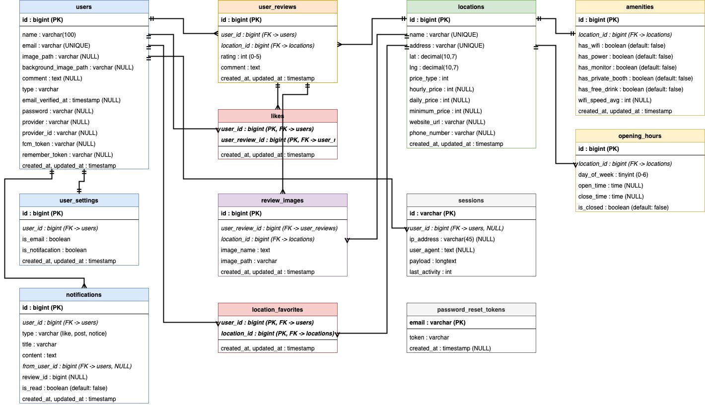

# TechNomadSpace 仕様書

## 1. プロジェクト概要

### 1.1 プロジェクト名
**TechNomadSpace**

### 1.2 概要
TechNomadSpaceは、ノマドワーカーや旅行をしながら働く人と気軽に利用したい人向けのコワーキングスペース検索サービスです。

**特徴:**
- 契約や事前予約が不要で、すぐに利用できる施設のみを掲載
- 料金体系は「完全無料」「ワンドリンク制」「ドロップイン（時間課金）」の3種類
- 使った分だけ支払うシンプルな料金システム

月額契約が必要なコワーキングスペースは掲載対象外とし、気軽に立ち寄れる施設だけを厳選して紹介しています。

### 1.3 このサービスを作った理由

近年、リモートワークやノマドワークが広がる中で、「今すぐ作業できる場所を見つけたい」というニーズが増えています。しかし、既存のコワーキングスペース検索サービスには以下のような課題がありました。

**既存サービスの課題:**
- 月額契約が必要な施設と、ドロップイン利用可能な施設が混在していて分かりにくい
- 予約が必要な施設が多く、急な作業には対応できない
- 料金体系が複雑で、実際にいくらかかるのか分かりにくい
- 旅行先や出張先で使える施設を探すのに時間がかかる

**TechNomadSpaceが解決すること:**
- ドロップイン利用可能な施設だけを掲載し、「今すぐ使える」を保証
- 料金タイプ（無料/ワンドリンク制/時間課金）を明確に表示
- 地図ベースで現在地周辺の施設をすぐに検索可能
- 実際の利用者レビューで、施設の雰囲気や使い勝手を事前に確認

「作業場所を探すストレスをなくし、作業に集中できる環境をすぐに見つけられる」ことを目指して開発しました。

### 1.4 ターゲットユーザー
| ユーザー層 | 利用シーン |
|-----------|-----------|
| ノマドワーカー | 各地を移動しながら働く人。新しい作業場所を常に探している |
| リモートワーカー | 自宅以外で集中して作業したい時に利用 |
| 旅行者 | 旅行中に急な仕事が入った時、作業スペースを探す |
| フリーランス | 気分転換に普段と違う場所で作業したい時に利用 |
| ビジネスパーソン | 出張先での空き時間に作業スペースが必要な時に利用 |
| 学生 | カフェ代わりに安く勉強・作業できる場所を探している |

**共通するニーズ:**
- 予約なしですぐに利用したい
- 使った分だけの支払いで済ませたい
- WiFi・電源など作業に必要な設備が整っている場所を探したい
- 事前に施設の雰囲気を知りたい

### 1.5 主要機能
- インタラクティブなマップでのコワーキングスペース検索
- 施設の詳細情報（料金、設備、営業時間）の閲覧
- ユーザーレビュー・評価の投稿・閲覧
- お気に入り施設の管理
- プッシュ通知によるアクティビティ通知
- ソーシャルログイン（Google認証）

---

## 2. システム構成

### 2.1 アーキテクチャ
```
┌─────────────────┐     ┌─────────────────┐     ┌─────────────────┐
│   Frontend      │     │   Backend       │     │   Database      │
│   (Next.js)     │────▶│   (Laravel)     │────▶│   (MySQL 8.0)   │
│   Port: 3000    │     │   Port: 8000    │     │   Port: 2000    │
└─────────────────┘     └─────────────────┘     └─────────────────┘
         │                      │
         │                      │
         ▼                      ▼
┌─────────────────┐     ┌─────────────────┐
│   Nginx         │     │   Firebase      │
│   (Reverse      │     │   (FCM Push     │
│   Proxy)        │     │   Notification) │
└─────────────────┘     └─────────────────┘
```

### 2.2 技術スタック

#### フロントエンド
| 技術 | バージョン | 用途 |
|------|-----------|------|
| Next.js | 16.1.6 | Reactフレームワーク |
| React | 19.2.3 | UIライブラリ |
| TypeScript | - | 型安全な開発 |
| Tailwind CSS | 4.0 | スタイリング |
| Chakra UI | 2.10.9 | UIコンポーネント |
| Leaflet | 1.9.4 | 地図表示 |
| react-leaflet | 5.0.0 | React用Leafletラッパー |
| SWR | 2.4.1 | データフェッチング |
| react-hook-form | 7.72.1 | フォーム管理 |
| Firebase | - | 認証・プッシュ通知 |
| Framer Motion | - | アニメーション |

#### バックエンド
| 技術 | バージョン | 用途 |
|------|-----------|------|
| Laravel | 12.0 | PHPフレームワーク |
| PHP | 8.2+ | サーバーサイド言語 |
| Laravel Sanctum | 4.3 | API認証 |
| Laravel Socialite | 5.26 | ソーシャル認証 |
| NotiFire | 1.2 | FCM通知送信 |
| PHPUnit | 11.5.3 | テスト |

#### インフラストラクチャ
| 技術 | バージョン | 用途 |
|------|-----------|------|
| Docker | - | コンテナ化 |
| Docker Compose | - | マルチコンテナ管理 |
| MySQL | 8.0 | データベース |
| Nginx | - | Webサーバー/リバースプロキシ |
| phpMyAdmin | - | DB管理UI |
| MailHog | - | メールテスト |

---

## 3. データベース設計

### 3.1 ER図



### 3.2 テーブル定義

#### users テーブル
| カラム名 | 型 | NULL | 説明 |
|---------|-----|------|------|
| id | BIGINT | NO | 主キー |
| name | VARCHAR(255) | NO | ユーザー名 |
| email | VARCHAR(255) | NO | メールアドレス（一意） |
| password | VARCHAR(255) | YES | ハッシュ化パスワード |
| image_path | VARCHAR(255) | YES | プロフィール画像パス |
| provider | VARCHAR(255) | YES | OAuth プロバイダー名 |
| provider_id | VARCHAR(255) | YES | OAuth プロバイダーID |
| fcm_token | VARCHAR(255) | YES | Firebase Cloud Messaging トークン |
| created_at | TIMESTAMP | NO | 作成日時 |
| updated_at | TIMESTAMP | NO | 更新日時 |

#### locations テーブル
| カラム名 | 型 | NULL | 説明 |
|---------|-----|------|------|
| id | BIGINT | NO | 主キー |
| name | VARCHAR(255) | NO | 施設名 |
| address | VARCHAR(255) | NO | 住所 |
| lat | DECIMAL(10,8) | NO | 緯度 |
| lng | DECIMAL(11,8) | NO | 経度 |
| price_type | TINYINT | NO | 料金タイプ（0:無料, 1:飲料代, 2:有料） |
| hourly_price | INT | YES | 時間料金（円） |
| daily_price | INT | YES | 日料金（円） |
| minimum_price | INT | YES | 最低利用料金（円） |
| website_url | VARCHAR(255) | YES | Webサイト URL |
| phone_number | VARCHAR(20) | YES | 電話番号 |
| created_at | TIMESTAMP | NO | 作成日時 |
| updated_at | TIMESTAMP | NO | 更新日時 |

#### amenities テーブル
| カラム名 | 型 | NULL | 説明 |
|---------|-----|------|------|
| id | BIGINT | NO | 主キー |
| location_id | BIGINT | NO | 施設ID（外部キー） |
| has_wifi | BOOLEAN | NO | WiFi有無 |
| has_power | BOOLEAN | NO | 電源有無 |
| has_monitor | BOOLEAN | NO | モニター有無 |
| has_private_booth | BOOLEAN | NO | 個室ブース有無 |
| has_free_drink | BOOLEAN | NO | フリードリンク有無 |
| wifi_speed_avg | INT | YES | WiFi平均速度（Mbps） |

#### opening_hours テーブル
| カラム名 | 型 | NULL | 説明 |
|---------|-----|------|------|
| id | BIGINT | NO | 主キー |
| location_id | BIGINT | NO | 施設ID（外部キー） |
| day_of_week | TINYINT | NO | 曜日（0:日〜6:土） |
| open_time | TIME | YES | 開店時間 |
| close_time | TIME | YES | 閉店時間 |
| is_closed | BOOLEAN | NO | 定休日フラグ |

#### user_reviews テーブル
| カラム名 | 型 | NULL | 説明 |
|---------|-----|------|------|
| id | BIGINT | NO | 主キー |
| user_id | BIGINT | NO | ユーザーID（外部キー） |
| location_id | BIGINT | NO | 施設ID（外部キー） |
| rating | TINYINT | NO | 評価（1〜5） |
| comment | TEXT | YES | コメント |
| created_at | TIMESTAMP | NO | 作成日時 |
| updated_at | TIMESTAMP | NO | 更新日時 |

#### review_images テーブル
| カラム名 | 型 | NULL | 説明 |
|---------|-----|------|------|
| id | BIGINT | NO | 主キー |
| user_review_id | BIGINT | NO | レビューID（外部キー） |
| location_id | BIGINT | NO | 施設ID（外部キー） |
| image_path | VARCHAR(255) | NO | 画像パス |

#### likes テーブル
| カラム名 | 型 | NULL | 説明 |
|---------|-----|------|------|
| id | BIGINT | NO | 主キー |
| user_id | BIGINT | NO | ユーザーID（外部キー） |
| user_review_id | BIGINT | NO | レビューID（外部キー） |
| created_at | TIMESTAMP | NO | 作成日時 |

#### location_favorites テーブル
| カラム名 | 型 | NULL | 説明 |
|---------|-----|------|------|
| id | BIGINT | NO | 主キー |
| user_id | BIGINT | NO | ユーザーID（外部キー） |
| location_id | BIGINT | NO | 施設ID（外部キー） |
| created_at | TIMESTAMP | NO | 作成日時 |

#### notifications テーブル
| カラム名 | 型 | NULL | 説明 |
|---------|-----|------|------|
| id | BIGINT | NO | 主キー |
| user_id | BIGINT | NO | 受信ユーザーID（外部キー） |
| type | VARCHAR(50) | NO | 通知タイプ |
| title | VARCHAR(255) | NO | 通知タイトル |
| content | TEXT | YES | 通知内容 |
| from_user_id | BIGINT | YES | 送信元ユーザーID |
| review_id | BIGINT | YES | 関連レビューID |
| is_read | BOOLEAN | NO | 既読フラグ |
| created_at | TIMESTAMP | NO | 作成日時 |

#### user_settings テーブル
| カラム名 | 型 | NULL | 説明 |
|---------|-----|------|------|
| id | BIGINT | NO | 主キー |
| user_id | BIGINT | NO | ユーザーID（外部キー） |
| email_notification | BOOLEAN | NO | メール通知設定 |

---

## 4. API仕様

### 4.1 認証方式
- **方式**: Bearer Token認証（Laravel Sanctum）
- **トークン有効期限**: 24時間（1440分）

### 4.2 エンドポイント一覧

#### 認証 API
| メソッド | エンドポイント | 説明 | 認証 |
|---------|---------------|------|------|
| POST | /api/register | ユーザー新規登録 | 不要 |
| POST | /api/login | ログイン | 不要 |
| POST | /api/logout | ログアウト | 必要 |
| GET | /api/auth/{provider}/redirect | OAuth認証リダイレクト | 不要 |
| POST | /api/auth/{provider}/callback | OAuthコールバック | 不要 |

#### ロケーション API
| メソッド | エンドポイント | 説明 | 認証 |
|---------|---------------|------|------|
| GET | /api/locations | 全コアーキングスペース一覧取得 | 不要 |
| GET | /api/location/{id} | コアーキングスペース詳細取得 | 不要 |

#### お気に入り API
| メソッド | エンドポイント | 説明 | 認証 |
|---------|---------------|------|------|
| POST | /api/locations/{id}/favorite | お気に入り登録/解除 | 必要 |
| GET | /api/favorite_locations | お気に入り一覧取得 | 必要 |

#### レビュー API
| メソッド | エンドポイント | 説明 | 認証 |
|---------|---------------|------|------|
| POST | /api/reviews/store | レビュー投稿 | 必要 |
| GET | /api/reviews/{id} | レビュー詳細取得 | 不要 |
| POST | /api/reviews/update/{id} | レビュー更新 | 必要 |
| DELETE | /api/reviews/destroy/{id} | レビュー削除 | 必要 |
| POST | /api/reviews/{id}/like | いいね登録/解除 | 必要 |

#### プロフィール API
| メソッド | エンドポイント | 説明 | 認証 |
|---------|---------------|------|------|
| GET | /api/profile | 自分のプロフィール取得 | 必要 |
| GET | /api/profile/{id} | 指定ユーザーのプロフィール取得 | 不要 |
| POST | /api/profile/edit | プロフィール更新 | 必要 |
| POST | /api/profile/edit/background_image | 背景画像更新 | 必要 |

#### ユーザー API
| メソッド | エンドポイント | 説明 | 認証 |
|---------|---------------|------|------|
| GET | /api/user | ユーザー情報取得 | 必要 |
| POST | /api/user/edit | ユーザー情報更新 | 必要 |
| DELETE | /api/user/delete | アカウント削除 | 必要 |

#### 設定 API
| メソッド | エンドポイント | 説明 | 認証 |
|---------|---------------|------|------|
| GET | /api/setting | 設定情報取得 | 必要 |
| POST | /api/setting/update | 設定更新 | 必要 |

#### 通知 API
| メソッド | エンドポイント | 説明 | 認証 |
|---------|---------------|------|------|
| GET | /api/notifications | 通知一覧取得 | 必要 |
| GET | /api/notifications/{id} | 通知詳細取得 | 必要 |
| GET | /api/notifications/unread_count | 未読通知数取得 | 必要 |
| PATCH | /api/notifications/{id}/read | 既読化 | 必要 |
| PATCH | /api/notifications/read_all | 全既読化 | 必要 |
| DELETE | /api/notifications/{id} | 通知削除 | 必要 |
| DELETE | /api/notifications/delete_all | 全通知削除 | 必要 |

#### FCM API
| メソッド | エンドポイント | 説明 | 認証 |
|---------|---------------|------|------|
| POST | /api/fcm/token | FCMトークン登録 | 必要 |
| DELETE | /api/fcm/token | FCMトークン削除 | 必要 |

## 5. 画面仕様

### 5.1 画面一覧

| 画面名 | パス | 説明 | 認証 |
|--------|------|------|------|
| ホーム | / | マップ表示、施設検索 | 不要 |
| ログイン | /login | ログイン画面 | 不要 |
| 新規登録 | /register | ユーザー登録画面 | 不要 |
| 施設詳細 | /locations/{id} | 施設情報、レビュー表示 | 不要 |
| レビュー投稿/編集 | /locations/{id}/review | レビュー作成・編集 | 必要 |
| プロフィール | /profile/{id} | ユーザープロフィール | 不要 |
| お気に入り | /favorite | お気に入り施設一覧 | 必要 |
| 通知一覧 | /notifications | 通知リスト | 必要 |
| 通知詳細 | /notifications/{id} | 通知詳細 | 必要 |
| 設定 | /setting | ユーザー設定 | 必要 |
| 利用規約 | /terms | 利用規約表示 | 不要 |
| プライバシーポリシー | /privacy | プライバシーポリシー表示 | 不要 |

### 5.2 主要画面詳細

#### ホーム画面 (/)
- **機能**:
  - 地図表示（Leaflet）
  - 施設位置のピン表示
  - ピンクリックで詳細シート表示
  - コアーキングスペースリスト表示
  - 検索機能

#### コアーキングスペース詳細画面 (/locations/{id})
- **機能**:
  - 施設基本情報表示（名前、住所、電話番号、Webサイト）
  - 地図での位置表示
  - 料金情報表示（時間料金、日料金）
  - 設備情報表示（WiFi、電源、モニター等）
  - 営業時間表示（曜日別）
  - レビュー一覧表示
  - 写真ギャラリー
  - お気に入り登録ボタン
  - レビュー投稿ボタン

#### プロフィール画面 (/profile/{id})
- **機能**:
  - ユーザー情報表示
  - プロフィール画像・背景画像表示
  - 投稿レビュー一覧
  - いいね済みレビュー一覧
  - プロフィール編集（自分の場合）

---

## 6. 機能仕様

### 6.1 認証機能

#### メール/パスワード認証
- **新規登録**: 名前、メールアドレス、パスワードで登録
- **ログイン**: メールアドレス、パスワードで認証
- **パスワード**: bcryptでハッシュ化して保存
- **トークン**: Sanctumによる24時間有効のBearerトークン発行

#### ソーシャルログイン（Google OAuth）
- **認証フロー**:
  1. フロントエンドからOAuth認証URLを取得
  2. Googleログイン画面へリダイレクト
  3. 認証成功後、コールバックURLへリダイレクト
  4. バックエンドでユーザー作成/更新、トークン発行
- **プロバイダー**: Google（Socialite使用）
- **ステートレス認証**: `stateless()` モードで実装

### 6.2 ロケーション機能

#### 施設検索
- 全施設一覧の取得
- 地図上でのピン表示
- 施設詳細情報の閲覧

#### 施設情報
- **基本情報**: 名前、住所、緯度経度、電話番号、Webサイト
- **料金情報**: 料金タイプ（無料/飲料代/有料）、時間料金、日料金、最低料金
- **設備情報**: WiFi、電源、モニター、個室ブース、フリードリンク、WiFi速度
- **営業時間**: 曜日別の開店/閉店時間、定休日

### 6.3 レビュー機能

#### レビュー投稿
- **評価**: 1〜5段階の星評価
- **コメント**: テキストコメント
- **画像**: 複数画像のアップロード（ファイルアップロード）

#### レビュー操作
- **編集**: 自分のレビューのみ編集可能
- **削除**: 自分のレビューのみ削除可能
- **いいね**: 他ユーザーのレビューにいいね可能（トグル）

### 6.4 お気に入り機能

- **登録/解除**: トグル方式で登録・解除
- **一覧表示**: お気に入り施設の一覧表示

### 6.5 通知機能

#### プッシュ通知（FCM）
- **FCMトークン管理**: ログイン時にトークン登録、ログアウト時に削除
- **通知送信**: いいね時に自動的にプッシュ通知送信

#### 通知管理
- **一覧表示**: ページネーション付き通知一覧
- **詳細表示**: 通知の詳細情報表示
- **既読管理**: 個別既読、全既読
- **削除**: 個別削除、全削除
- **未読カウント**: 未読通知数の取得

### 6.6 プロフィール機能

#### プロフィール表示
- ユーザー基本情報
- プロフィール画像
- 背景画像
- 投稿レビュー一覧
- いいね済みレビュー一覧

#### プロフィール編集
- 名前の変更
- プロフィール画像の変更
- 背景画像の変更


---

## 9. 開発環境

### 9.1 必要ソフトウェア
- Docker Desktop
- Node.js 23+
- PHP 8.2+
- Composer

### 9.2 セットアップ手順
```bash
# リポジトリのクローン
git clone [repository-url]
cd TechNomadSpace

# Dockerコンテナを構築。
docker compose build

# Dockerコンテナの起動
docker-compose up -d

# バックエンドの依存関係インストール
docker-compose exec bash api composer install

# マイグレーション実行
docker-compose exec bash api php artisan migrate

# シーダー実行
docker-compose exec bash api php artisan db:seed

# フロントエンドの依存関係インストール
docker-compose exec next sh && npm install
```

### 9.3 開発サーバー
| サービス | URL | 説明 |
|---------|-----|------|
| フロントエンド | http://localhost:3000 | Next.js開発サーバー |
| バックエンドAPI | http://localhost:8000 | Laravel APIサーバー |
| phpMyAdmin | http://localhost:10000 | DB管理ツール |
| MailHog | http://localhost:8025 | メールテストツール |

---

## 10. ディレクトリ構成

```
TechNomadSpace/
├── frontend/
│   └── next/
│       ├── app/                 # Next.js App Router
│       ├── components/          # Reactコンポーネント
│       ├── services/            # API通信サービス
│       ├── types/               # TypeScript型定義
│       ├── lib/                 # ユーティリティ
│       ├── public/              # 静的ファイル
│       ├── package.json
│       └── tsconfig.json
├── backend/
│   └── src/
│       └── app/
│           ├── app/
│           │   ├── Http/
│           │   │   ├── Controllers/
│           │   │   ├── Requests/
│           │   │   └── Resources/
│           │   ├── Models/
│           │   ├── Services/
│           │   ├── Enums/
│           │   └── Providers/
│           ├── config/
│           ├── database/
│           │   ├── migrations/
│           │   ├── factories/
│           │   └── seeders/
│           ├── routes/
│           ├── storage/
│           └── tests/
├── docker/
│   ├── php/
│   └── nginx/
├── docker-compose.yml
└── docs/
    └── SPECIFICATION.md
```

---

## 11. 今後の開発予定

### 11.1 実装済み機能
- [x] ユーザー認証（メール/パスワード）
- [x] ソーシャルログイン（Google）
- [x] 施設検索・詳細表示
- [x] マップ表示
- [x] レビュー投稿・編集・削除
- [x] お気に入り機能
- [x] いいね機能
- [x] プッシュ通知
- [x] 通知管理
- [x] プロフィール機能

### 11.2 検討中の機能
- [ ] 施設の絞り込み検索（設備、料金等）
- [ ] レビューへのコメント機能
- [ ] 施設情報の編集リクエスト
---

## 12. 変更履歴

| バージョン | 日付 | 変更内容 |
|-----------|------|----------|
| 1.0.0 | 2026-05-14 | 初版作成 |

---

## 13. 付録

### 13.1 PriceType 定数
| 値 | 名称 | 説明 |
|----|------|------|
| 0 | TotallyFree | 完全無料 |
| 1 | DrinkOnly | 飲料代のみ |
| 2 | Paid | 有料 |

### 13.2 NotificationType 定数
| 値 | 説明 |
|----|------|
| like | レビューいいね通知 |

### 13.3 day_of_week 定数
| 値 | 曜日 |
|----|------|
| 0 | 日曜日 |
| 1 | 月曜日 |
| 2 | 火曜日 |
| 3 | 水曜日 |
| 4 | 木曜日 |
| 5 | 金曜日 |
| 6 | 土曜日 |
